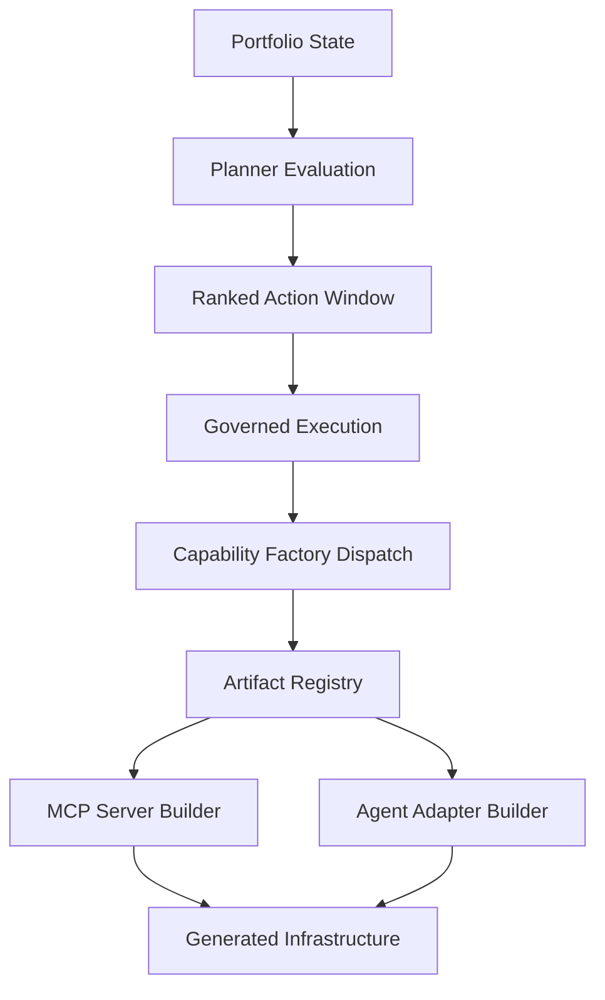

# MCP Governance Orchestrator

Adaptive automation system evolving into a research-grade reference architecture for:

**Governed Autonomous Capability Factories for Model Context Protocol Infrastructure**

This repository implements a deterministic governed factory that can:

- execute Tier-3 portfolio tasks
- derive portfolio state
- generate prioritized actions
- evaluate action outcomes
- adaptively adjust planner behavior
- detect missing capabilities
- generate capability artifacts through a governed factory pipeline

The system forms a closed optimization and generation loop.

---

# Architecture

Full architecture reference:

docs/ARCHITECTURE_V0_10.md

High-level loop:

portfolio state  
→ planner evaluation  
→ ranked action window  
→ governed execution  
→ capability factory dispatch  
→ artifact registry  
→ capability builder  
→ generated infrastructure  
→ effectiveness learning  
→ next cycle

---

# Governed Autonomous Capability Factories

The repository now supports a generalized capability-factory architecture.

## Core idea

Instead of treating missing infrastructure as a static gap, the system can:

- detect a missing capability in portfolio state
- surface a governed build action through the planner
- route the action through the governed execution layer
- dispatch to a registered capability builder
- generate the required infrastructure artifact deterministically

## Current factory flow

Planner  
→ Governance Layer  
→ Capability Factory  
→ Artifact Registry  
→ Capability Builders  
→ Generated Infrastructure

## Current supported artifact kinds

- mcp_server
- agent_adapter

## Example supported capabilities

- github_repository_management
- slack_workspace_access
- postgres_data_access

## Builder registry model

Capability builders register through a decorator-based plugin system:

builder/artifact_registry.py

Example pattern:

@register_builder("mcp_server")
def build_mcp_server(...):
    ...

---

# Capability Factory Demo

Run the governed capability factory demo:

python3 scripts/run_factory_capability_demo.py

This demonstrates a capability gap being converted into a governed build action and then into a generated artifact repository.

## Multi-cycle factory demo with ledger carry-forward

Run two sequential factory cycles to observe capability ledger accumulation:

```bash
# Cycle 1 — synthesize artifact, write capability ledger from scratch
PYTHONPATH=. python3 scripts/run_autonomous_factory_cycle.py \
    --portfolio-state experiments/factory_demo/portfolio_state_missing_github.json \
    --capability-ledger-output demo_live_capability_ledger.json \
    --output demo_live_cycle_1.json

# Cycle 2 — second synthesis, ledger carries forward from cycle 1
PYTHONPATH=. python3 scripts/run_autonomous_factory_cycle.py \
    --portfolio-state experiments/factory_demo/portfolio_state_missing_github.json \
    --capability-ledger demo_live_capability_ledger.json \
    --capability-ledger-output demo_live_capability_ledger.json \
    --output demo_live_cycle_2.json
```

`total_syntheses` increments 0→1→2 across cycles. The `previous_similarity_score`
from cycle 1 threads into cycle 2's synthesis event, producing a measurable
`capability_reliability_component` shift in the planner's next action ranking.

---

# Running Tests

Run the full regression suite:

PYTHONPATH=. pytest -q

Current coverage:

2978 tests passing

---

# Capability Factory Architecture Diagram



This diagram captures the current governed capability-factory path:

- portfolio state surfaces capability gaps
- planner evaluation prioritizes build actions
- governed execution authorizes factory dispatch
- artifact registry routes to the correct builder
- builders deterministically generate infrastructure artifacts

Example generated infrastructure currently includes:

- generated_mcp_server_github/
- generated_agent_adapter_slack/

---

# Capability Score Gate

The system enforces a governed capability score gate at Phase L of each cycle.
The gate computes a smoothed success rate per capability from the
capability effectiveness ledger and blocks the cycle if any named capability
falls below its configured threshold.

## Gate mechanism

Defined in the governance policy under `capability_score_gate`:

```json
{
  "capability_score_gate": { "github": 0.75 }
}
```

Phase L reads the capability ledger, computes a per-capability smoothed success
rate `(successful_syntheses + 1) / (total_syntheses + 2)`, and aborts the cycle
if the rate falls below the threshold.

## BEFORE state

Capability ledger before additional syntheses:

| Capability | Total | Successful | Similarity | Delta | Status |
|---|---|---|---|---|---|
| github | 5 | 4 | 0.82 | +0.08 | ok |
| filesystem | 3 | 1 | 0.55 | -0.12 | failed |

Phase L evaluation result: **abort**

- github smoothed success rate: 0.714 (threshold: 0.75) → gate fires
- filesystem: declining trajectory, last comparison failed

## AFTER state

Capability ledger after evolved syntheses:

| Capability | Total | Successful | Similarity | Delta | Status |
|---|---|---|---|---|---|
| github | 8 | 7 | 0.91 | +0.09 | ok |
| filesystem | 6 | 4 | 0.71 | +0.16 | ok |
| search | 2 | 2 | 0.78 | — | ok (new) |

Phase L evaluation result: **continue**

- github smoothed success rate now clears the 0.75 threshold
- filesystem recovered: similarity score 0.55 → 0.71, delta reversed from -0.12 to +0.16
- search capability added: 2/2 successful syntheses at 0.78 similarity

## Live cycle confirmation

The governed multi-cycle run with the AFTER ledger (`governed_capability_after_demo.json`)
confirmed gate clearance: 3 cycles completed, all status ok, governance decision: continue,
no regression detected.

## Demo fixtures

experiments/capability_ledger_synthetic_before.json — BEFORE ledger  
experiments/capability_ledger_synthetic_after.json — AFTER ledger  
demo_capability_gate_policy.json — governance policy with gate threshold  
demo_capability_gate_before.json — Phase L abort decision  
demo_capability_gate_after.json — Phase L continue decision  

---

# Planner Scoring View

The capability ledger feeds the planner's per-action priority ranking.
Each action receives a `capability_reliability_component` derived from the
smoothed synthesis history of the capability it targets.

## Scoring signal: BEFORE vs AFTER ledger state

With `experiments/portfolio_state_capability_github.json` as the portfolio state
(non-idle; contains an eligible `build_capability_artifact` action for the `github`
capability), the scoring path produces measurably different per-action priorities
depending on ledger state:

| Action | Ledger | capability_reliability_component | final_priority | delta |
|---|---|---|---|---|
| analyze_repo_insights | BEFORE | 0.000 | 0.6578 | — |
| analyze_repo_insights | AFTER | 0.000 | 0.6578 | 0.000 |
| build_capability_artifact | BEFORE | 0.017229 | 0.602229 | — |
| build_capability_artifact | AFTER | 0.022329 | 0.607329 | +0.005100 |

The `build_capability_artifact` action's `capability_reliability_component` rises
from 0.017229 to 0.022329 (+0.005100) as the github synthesis history improves from
4/5 to 7/8 successful syntheses, with similarity score advancing from 0.82 to 0.91.
The `analyze_repo_insights` action carries no capability reliability signal (it
targets no specific capability), so its priority is unchanged between ledger states.

## Confirmed values

Confirmed by direct scoring path execution using
`experiments/portfolio_state_capability_github.json`:

BEFORE (`experiments/capability_ledger_synthetic_before.json`):

```json
{
  "action_type": "build_capability_artifact",
  "base_priority": 0.535,
  "capability_reliability_component": 0.017229,
  "exploration_component": 0.05,
  "final_priority": 0.602229
}
```

AFTER (`experiments/capability_ledger_synthetic_after.json`):

```json
{
  "action_type": "build_capability_artifact",
  "base_priority": 0.535,
  "capability_reliability_component": 0.022329,
  "exploration_component": 0.05,
  "final_priority": 0.607329
}
```

## Explain sidecar archival

Each planner run with `--explain` and `--capability-ledger` writes:

- `planner_priority_breakdown.json` — per-action component breakdown
- `planner_scoring_metrics.json` — per-component raw value, scaled value, and confidence flag

**Note:** the scoring path is only exercised when the portfolio state contains
eligible capability build actions. Idle-repo cycles (empty action window) exit the
governed loop before the planner runs; any archived sidecar from an idle cycle
reflects the last non-idle run's output, not the current cycle's ledger state. Use
`experiments/portfolio_state_capability_github.json` to exercise the live path.
