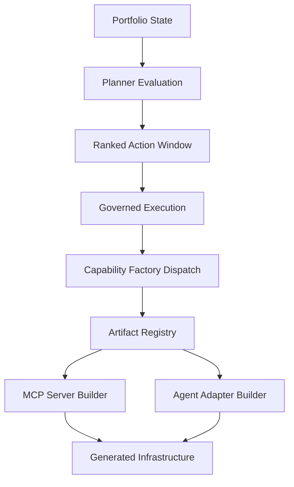

# Governed Autonomous Capability Factories

Adaptive automation system evolving into a research-grade reference architecture for:

**Governed Autonomous Capability Factories for Model Context Protocol Infrastructure**

This repository implements a deterministic governed factory that can:

- execute Tier-3 portfolio tasks
- derive portfolio state
- generate prioritized actions
- evaluate action outcomes
- adaptively adjust planner behavior
- detect missing capabilities
- generate capability artifacts through a governed factory pipeline

The system forms a closed optimization and generation loop.

---

# Architecture

Full architecture reference:

docs/ARCHITECTURE_V0_10.md

High-level loop:

portfolio state  
→ planner evaluation  
→ ranked action window  
→ governed execution  
→ capability factory dispatch  
→ artifact registry  
→ capability builder  
→ generated infrastructure  
→ effectiveness learning  
→ next cycle

---

# Governed Autonomous Capability Factories

The repository now supports a generalized capability-factory architecture.

## Core idea

Instead of treating missing infrastructure as a static gap, the system can:

- detect a missing capability in portfolio state
- surface a governed build action through the planner
- route the action through the governed execution layer
- dispatch to a registered capability builder
- generate the required infrastructure artifact deterministically

## Current factory flow

Planner  
→ Governance Layer  
→ Capability Factory  
→ Artifact Registry  
→ Capability Builders  
→ Generated Infrastructure

## Current supported artifact kinds

- mcp_server
- agent_adapter

## Example supported capabilities

- github_repository_management
- slack_workspace_access
- postgres_data_access

## Builder registry model

Capability builders register through a decorator-based plugin system:

builder/artifact_registry.py

Example pattern:

@register_builder("mcp_server")
def build_mcp_server(...):
    ...

---

# One-Command Governed Portfolio Cycle

Run a full A→L governed portfolio cycle with example-safe defaults:

```bash
PYTHONPATH=src:. python3 scripts/run_example_governed_cycles.py
```

Generates the example manifest then runs one governed cycle: `health_probe_example` task,
top-k 2, ledger `experiments/action_effectiveness_ledger_synthetic_v2.json`.

To run multiple cycles with ledger carry-forward:

```bash
PYTHONPATH=src:. python3 scripts/run_example_governed_cycles.py --cycles 3
```

All CLI defaults are overridable. Run with `--help` to see available options.

---

# Capability Factory Demo

Run the governed capability factory demo:

python3 scripts/run_factory_capability_demo.py

This demonstrates a capability gap being converted into a governed build action and then into a generated artifact repository.

## Multi-cycle factory demo with ledger carry-forward

Run two sequential factory cycles to observe capability ledger accumulation:

```bash
# Cycle 1 — synthesize artifact, write capability ledger from scratch
PYTHONPATH=src:. python3 scripts/run_autonomous_factory_cycle.py \
    --portfolio-state experiments/factory_demo/portfolio_state_missing_github.json \
    --capability-ledger-output demo_live_capability_ledger.json \
    --output demo_live_cycle_1.json

# Cycle 2 — second synthesis, ledger carries forward from cycle 1
PYTHONPATH=src:. python3 scripts/run_autonomous_factory_cycle.py \
    --portfolio-state experiments/factory_demo/portfolio_state_missing_github.json \
    --capability-ledger demo_live_capability_ledger.json \
    --capability-ledger-output demo_live_capability_ledger.json \
    --output demo_live_cycle_2.json
```

`total_syntheses` increments 0→1→2 across cycles. The `previous_similarity_score`
from cycle 1 threads into cycle 2's synthesis event, producing a measurable
`capability_reliability_component` shift in the planner's next action ranking.

## Confirmed evolution values

The confirmed zero-start behavior — running from a blank ledger across five
cycles — shows the component rising monotonically after an initial negative
value at cycle 1:

| State | total_syntheses | capability_reliability_component | final_priority |
|---|---|---|---|
| After cycle 1 | 1 | -0.000667 | 0.653333 |
| After cycle 2 | 2 | 0.002000 | 0.655000 |
| After cycle 3 | 3 | 0.006000 | 0.658000 |
| After cycle 4 | 4 | 0.010667 | 0.661667 |
| After cycle 5 | 5 | 0.015714 | 0.665714 |

Confirmed from `demo_plateau_breakdown_{1..5}.json` — zero-start ledger, 5 consecutive
synthesis cycles, no prior state.

The five-cycle zero-start trace above shows `capability_reliability_component` rising
from -0.000667 to 0.015714 across consecutive synthesis events from a blank ledger.
The [Planner Scoring View](#planner-scoring-view) below demonstrates the same signal
from a pre-populated synthetic ledger (5→8 prior syntheses), where the component rises
from 0.017229→0.022329. Both are independent illustrations of the same adaptive
feedback path.

## Live Learning Loop: BEFORE/AFTER Synthesis Delta

Confirmed this session from a zero-entry capability ledger against
`experiments/factory_demo/portfolio_state_missing_github.json`.

**BEFORE** — capability ledger contains no `github_repository_management` entry.

**AFTER** — single factory cycle via `run_autonomous_factory_cycle.py`:

| Field | Value |
|---|---|
| last_synthesis_source | portfolio_gap |
| last_synthesis_status | ok |
| last_synthesis_used_evolution | true |
| successful_syntheses | 1 |
| total_syntheses | 1 |
| failed_syntheses | 0 |
| similarity_score | 1.0 |
| last_comparison_status | ok |

The evolution executor ran one evolution step: base build scored overall_score 0.24
(tool surface 0.0, capability surface 0.14); after evolution, all four dimensions
reached 1.0. The `last_synthesis_used_evolution: true` flag confirms the executor
param-preservation path is load-bearing on live synthesis runs.

**Command:**

```bash
PYTHONPATH=src:. python3 scripts/run_autonomous_factory_cycle.py \
    --portfolio-state experiments/factory_demo/portfolio_state_missing_github.json \
    --capability-ledger-output demo_live_learning_cap_ledger_after.json \
    --output demo_live_learning_cycle.json
```

Multi-cycle carry-forward via `run_portfolio_cycles.py` with `--capability-ledger`
confirmed across 3 cycles (governance: continue, all ok). The work-dir capability
ledger is automatically pinned into each subsequent cycle command.

**Command:**

```bash
PYTHONPATH=src:. python3 scripts/run_example_governed_cycles.py \
    --cycles 3 \
    --capability-ledger capability_effectiveness_ledger.json
```

`run_example_governed_cycles.py` generates the example manifest and wraps `run_portfolio_cycles.py`; `--capability-ledger` seeds cycle 1 and is auto-pinned for cycles 2 and 3.

---

# Running Tests

Run the full regression suite:

PYTHONPATH=. pytest -q

Current coverage:

3003 tests passing

---

# Capability Factory Architecture Diagram



This diagram captures the current governed capability-factory path:

- portfolio state surfaces capability gaps
- planner evaluation prioritizes build actions
- governed execution authorizes factory dispatch
- artifact registry routes to the correct builder
- builders deterministically generate infrastructure artifacts

Example generated infrastructure currently includes:

- generated_mcp_server_github/
- generated_agent_adapter_slack/

---

# Capability Score Gate

The system enforces a governed capability score gate at Phase L of each cycle.
The gate computes a smoothed success rate per capability from the
capability effectiveness ledger and blocks the cycle if any named capability
falls below its configured threshold.

## Gate mechanism

Defined in the governance policy under `capability_score_gate`:

```json
{
  "capability_score_gate": { "github": 0.75 }
}
```

Phase L reads the capability ledger, computes a per-capability smoothed success
rate `(successful_syntheses + 1) / (total_syntheses + 2)`, and aborts the cycle
if the rate falls below the threshold.

## BEFORE state

Capability ledger before additional syntheses:

| Capability | Total | Successful | Similarity | Delta | Status |
|---|---|---|---|---|---|
| github | 5 | 4 | 0.82 | +0.08 | ok |
| filesystem | 3 | 1 | 0.55 | -0.12 | failed |

Phase L evaluation result: **abort**

- github smoothed success rate: 0.714 (threshold: 0.75) → gate fires
- filesystem: declining trajectory, last comparison failed

## AFTER state

Capability ledger after evolved syntheses:

| Capability | Total | Successful | Similarity | Delta | Status |
|---|---|---|---|---|---|
| github | 8 | 7 | 0.91 | +0.09 | ok |
| filesystem | 6 | 4 | 0.71 | +0.16 | ok |
| search | 2 | 2 | 0.78 | — | ok (new) |

Phase L evaluation result: **continue**

- github smoothed success rate now clears the 0.75 threshold
- filesystem recovered: similarity score 0.55 → 0.71, delta reversed from -0.12 to +0.16
- search capability added: 2/2 successful syntheses at 0.78 similarity

## Live cycle confirmation

The governed multi-cycle run with the AFTER ledger (`governed_capability_after_demo.json`)
confirmed gate clearance: 3 cycles completed, all status ok, governance decision: continue,
no regression detected.

## Demo fixtures

experiments/capability_ledger_synthetic_before.json — BEFORE ledger  
experiments/capability_ledger_synthetic_after.json — AFTER ledger  
demo_capability_gate_policy.json — governance policy with gate threshold  
demo_capability_gate_before.json — Phase L abort decision  
demo_capability_gate_after.json — Phase L continue decision  

## Live gate command

To reproduce the BEFORE (gate fires) and AFTER (gate clears) decisions, run Phase L
directly against the fixture ledgers — no full cycle execution required:

**BEFORE** — gate fires, decision: abort:

```bash
PYTHONPATH=src:. python3 scripts/enforce_governance_policy.py \
    --history demo_seed_history.json \
    --summary demo_seed_summary.json \
    --policy demo_capability_gate_policy.json \
    --capability-ledger experiments/capability_ledger_synthetic_before.json \
    --output demo_capability_gate_before.json
```

**AFTER** — gate clears, decision: continue:

```bash
PYTHONPATH=src:. python3 scripts/enforce_governance_policy.py \
    --history demo_seed_history.json \
    --summary demo_seed_summary.json \
    --policy demo_capability_gate_policy.json \
    --capability-ledger experiments/capability_ledger_synthetic_after.json \
    --output demo_capability_gate_after.json
```

---

# Planner Scoring View

The capability ledger feeds the runtime planner (`planner_runtime.py`) per-action priority ranking.
Each action receives a `capability_reliability_component` derived from the
smoothed synthesis history of the capability it targets.

## Scoring signal: BEFORE vs AFTER ledger state

With `experiments/portfolio_state_capability_github.json` as the portfolio state
(non-idle; contains an eligible `build_capability_artifact` action for the `github`
capability), the scoring path produces measurably different per-action priorities
depending on ledger state:

| Action | Ledger | capability_reliability_component | final_priority | delta |
|---|---|---|---|---|
| analyze_repo_insights | BEFORE | 0.000 | 0.6578 | — |
| analyze_repo_insights | AFTER | 0.000 | 0.6578 | 0.000 |
| build_capability_artifact | BEFORE | 0.017229 | 0.602229 | — |
| build_capability_artifact | AFTER | 0.022329 | 0.607329 | +0.005100 |

The `build_capability_artifact` action's `capability_reliability_component` rises
from 0.017229 to 0.022329 (+0.005100) as the github synthesis history improves from
4/5 to 7/8 successful syntheses, with similarity score advancing from 0.82 to 0.91.
The `analyze_repo_insights` action carries no capability reliability signal (it
targets no specific capability), so its priority is unchanged between ledger states.

## Confirmed values

Confirmed by direct scoring path execution using
`experiments/portfolio_state_capability_github.json`:

BEFORE (`experiments/capability_ledger_synthetic_before.json`):

```json
{
  "action_type": "build_capability_artifact",
  "base_priority": 0.535,
  "capability_reliability_component": 0.017229,
  "exploration_component": 0.05,
  "final_priority": 0.602229
}
```

AFTER (`experiments/capability_ledger_synthetic_after.json`):

```json
{
  "action_type": "build_capability_artifact",
  "base_priority": 0.535,
  "capability_reliability_component": 0.022329,
  "exploration_component": 0.05,
  "final_priority": 0.607329
}
```

## Explain sidecar archival

Each planner run with `--explain` and `--capability-ledger` writes:

- `planner_priority_breakdown.json` — per-action component breakdown
- `planner_scoring_metrics.json` — per-component raw value, scaled value, and confidence flag

**Note:** the scoring path is only exercised when the portfolio state contains
eligible capability build actions. Idle-repo cycles (empty action window) exit the
governed loop before the planner runs; explain sidecar archival is suppressed for
idle cycles. Use `experiments/portfolio_state_capability_github.json` to exercise
the live path.

## Live scoring command

To reproduce the BEFORE/AFTER scoring values above, run directly against the fixture
portfolio state — no manifest or task execution required:

**BEFORE** (`experiments/capability_ledger_synthetic_before.json`):

```bash
PYTHONPATH=src:. python3 scripts/run_governed_planner_loop.py \
    --portfolio-state experiments/portfolio_state_capability_github.json \
    --ledger experiments/action_effectiveness_ledger_synthetic_v2.json \
    --capability-ledger experiments/capability_ledger_synthetic_before.json \
    --explain \
    --output governed_scoring_before.json
```

**AFTER** (`experiments/capability_ledger_synthetic_after.json`):

```bash
PYTHONPATH=src:. python3 scripts/run_governed_planner_loop.py \
    --portfolio-state experiments/portfolio_state_capability_github.json \
    --ledger experiments/action_effectiveness_ledger_synthetic_v2.json \
    --capability-ledger experiments/capability_ledger_synthetic_after.json \
    --explain \
    --output governed_scoring_after.json
```

After each run, `planner_priority_breakdown.json` in the working directory contains
the per-action component breakdown confirming the `capability_reliability_component`
delta between ledger states.

---

# Ledger-Aware Action Suppression

When `plan_capability_evolution()` in `capability_evolution_planner.py` receives both a `capability_ledger` and a `capability` argument, it inspects the ledger row for the named capability before building the evolution plan. If the ledger signals a declining similarity trajectory, additive actions are suppressed and a flag is set in the returned dict so callers can detect and log the suppression.

## Trigger condition

Suppression fires when the ledger row for the named capability carries a `similarity_delta` value that is strictly less than zero (`similarity_delta < 0`). A negative delta means the capability's embedding similarity to its target has worsened since the previous cycle, indicating the current evolution strategy is not improving the capability.

## Suppressed action types

The following action types are filtered from the evolution plan when the trigger condition is met:

- `add_tool`
- `enable_feature`

Suppressing these additive actions prevents compounding a failing approach: when a declining similarity trajectory is present, adding more tools or enabling more features has not been demonstrated to help and may deepen the divergence.

## Return signal

The returned dict always contains `evolution_actions` and `action_count`. When suppression fires, it additionally contains:

```json
{
  "evolution_actions": [],
  "action_count": 0,
  "ledger_suppressed": true
}
```

`ledger_suppressed: True` is the canonical signal that one or more actions were dropped due to a negative ledger delta for the named capability. Callers should treat its absence as equivalent to `false` (no suppression occurred).

## Source

`capability_evolution_planner.py`, function `plan_capability_evolution()` — this suppression logic is distinct from the scoring path implemented in `planner_runtime.py`. The planner runtime handles priority scoring and action ordering; ledger-aware suppression is a gate applied earlier in `plan_capability_evolution()` before the scored plan is assembled.

## Live Suppression Demonstration

The following shows the observed output of a live cycle run using the fixture at `experiments/capability_ledger_suppression_demo.json`, which seeds `github_repository_management` with `similarity_delta: -0.15` to trigger suppression deterministically.

```bash
PYTHONPATH=src:. python3 scripts/run_autonomous_factory_cycle.py \
    --portfolio-state experiments/factory_demo/portfolio_state_missing_github.json \
    --capability-ledger experiments/capability_ledger_suppression_demo.json \
    --output autonomous_factory_cycle.json
```

The five confirmed signals from the cycle result establish that suppression fired:

```json
{
  "evolution_regression_signal": { "prior_similarity_delta": -0.15 },
  "capability_evolution_plan": {
    "ledger_suppressed": true,
    "action_count": 1
  },
  "evolution_blocked_by_similarity_regression": true,
  "capability_evolution_execution": {
    "executed_action_count": 1
  }
}
```

`prior_similarity_delta: -0.15` is the value detected at execution time and is what triggered suppression. `action_count: 1` reflects selective filtering: `add_tool` and `enable_feature` actions were suppressed, but `increase_test_coverage` survived because it is not an additive action type covered by the suppression gate. The surviving action carried `coverage_ratio: 0.14` in the reference comparison output.

After the cycle completed, the ledger write-back deepened `similarity_delta` for `github_repository_management` from `-0.15` to `-0.46`. A second cycle run against the same fixture confirmed longitudinal carry-forward: `prior_similarity_delta` was read as `-0.46` (the deepened value), `ledger_suppressed` fired again as `true`, and `learning_update.applied` was `false` (reason: `no_ledger_path`). Suppression and carry-forward are demonstrated across two consecutive cycles.

| Cycle | `prior_similarity_delta` read | `ledger_suppressed` | Ledger write-back `similarity_delta` | `learning_update.applied` |
|-------|-------------------------------|---------------------|--------------------------------------|---------------------------|
| 1     | -0.15 (seeded)                | true                | -0.46 (deepened)                     | false (`no_ledger_path`)  |
| 2     | -0.46 (carry-forward)         | true                | —                                    | false (`no_ledger_path`)  |

**Operational note — `no_ledger_path`:** When `--capability-ledger-output` is omitted from the cycle run command, the planner has no path to write learning updates back to the ledger. The cycle completes normally, but `learning_update.applied` is `false` with `reason: no_ledger_path`. This is a silent non-error: suppression and plan assembly still execute correctly, but the ledger is not updated. Longitudinal carry-forward requires `--capability-ledger-output` to be set so each cycle can persist its `similarity_delta` for the next cycle to read.
