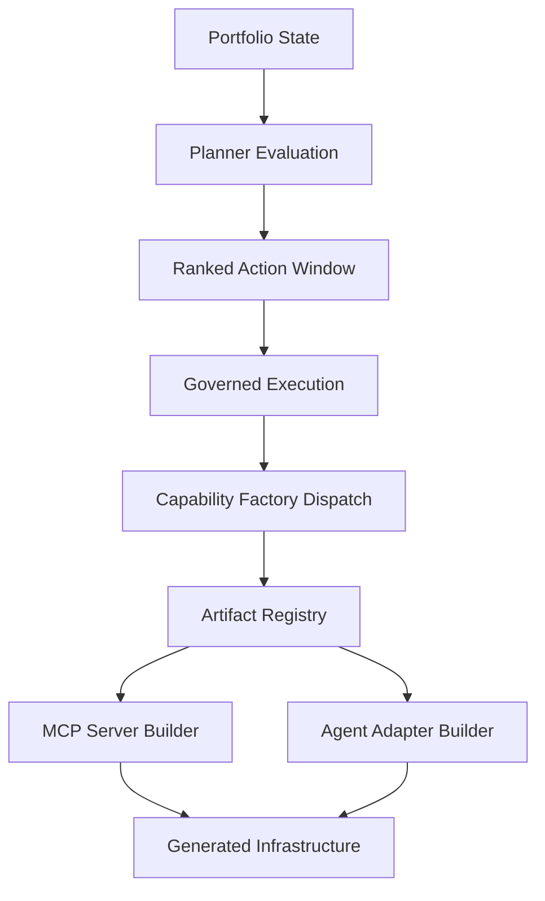

# MCP Governance Orchestrator

Adaptive automation system evolving into a research-grade reference architecture for:

**Governed Autonomous Capability Factories for Model Context Protocol Infrastructure**

This repository implements a deterministic governed factory that can:

- execute Tier-3 portfolio tasks
- derive portfolio state
- generate prioritized actions
- evaluate action outcomes
- adaptively adjust planner behavior
- detect missing capabilities
- generate capability artifacts through a governed factory pipeline

The system forms a closed optimization and generation loop.

---

# Architecture

Full architecture reference:

docs/ARCHITECTURE_V0_10.md

High-level loop:

portfolio state  
→ planner evaluation  
→ ranked action window  
→ governed execution  
→ capability factory dispatch  
→ artifact registry  
→ capability builder  
→ generated infrastructure  
→ effectiveness learning  
→ next cycle

---

# Governed Autonomous Capability Factories

The repository now supports a generalized capability-factory architecture.

## Core idea

Instead of treating missing infrastructure as a static gap, the system can:

- detect a missing capability in portfolio state
- surface a governed build action through the planner
- route the action through the governed execution layer
- dispatch to a registered capability builder
- generate the required infrastructure artifact deterministically

## Current factory flow

Planner  
→ Governance Layer  
→ Capability Factory  
→ Artifact Registry  
→ Capability Builders  
→ Generated Infrastructure

## Current supported artifact kinds

- mcp_server
- agent_adapter

## Example supported capabilities

- github_repository_management
- slack_workspace_access
- postgres_data_access

## Builder registry model

Capability builders register through a decorator-based plugin system:

builder/artifact_registry.py

Example pattern:

@register_builder("mcp_server")
def build_mcp_server(...):
    ...

---

# Capability Factory Demo

Run the governed capability factory demo:

python3 scripts/run_factory_capability_demo.py

This demonstrates a capability gap being converted into a governed build action and then into a generated artifact repository.

---

# Running Tests

Run the full regression suite:

PYTHONPATH=. pytest -q

Current coverage:

2974 tests passing

---

# Capability Factory Architecture Diagram

This diagram captures the current governed capability-factory path:

- portfolio state surfaces capability gaps
- planner evaluation prioritizes build actions
- governed execution authorizes factory dispatch
- artifact registry routes to the correct builder
- builders deterministically generate infrastructure artifacts

Example generated infrastructure currently includes:

- generated_mcp_server_github/
- generated_agent_adapter_slack/
