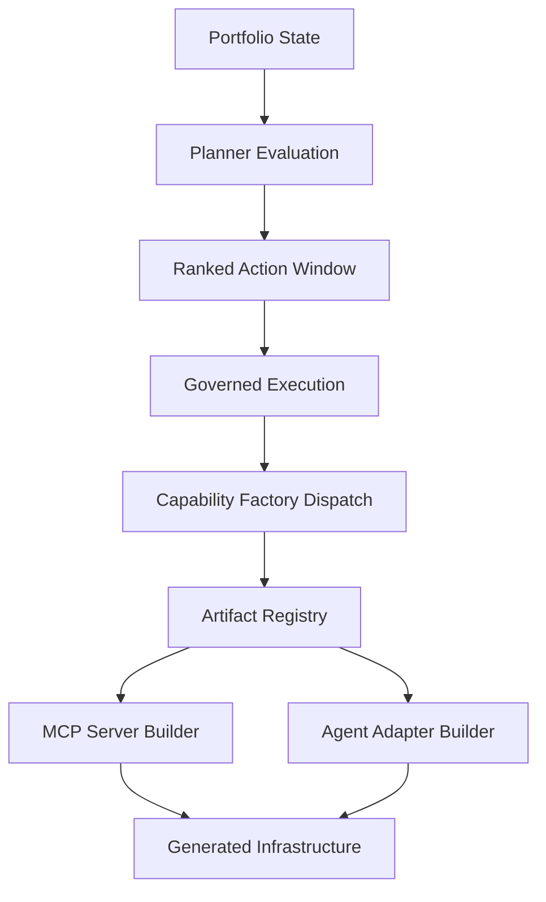

# MCP Governance Orchestrator

Adaptive automation system evolving into a research-grade reference architecture for:

**Governed Autonomous Capability Factories for Model Context Protocol Infrastructure**

This repository implements a deterministic governed factory that can:

- execute Tier-3 portfolio tasks
- derive portfolio state
- generate prioritized actions
- evaluate action outcomes
- adaptively adjust planner behavior
- detect missing capabilities
- generate capability artifacts through a governed factory pipeline

The system forms a closed optimization and generation loop.

---

# Architecture

Full architecture reference:

docs/ARCHITECTURE_V0_10.md

High-level loop:

portfolio state  
→ planner evaluation  
→ ranked action window  
→ governed execution  
→ capability factory dispatch  
→ artifact registry  
→ capability builder  
→ generated infrastructure  
→ effectiveness learning  
→ next cycle

---

# Governed Autonomous Capability Factories

The repository now supports a generalized capability-factory architecture.

## Core idea

Instead of treating missing infrastructure as a static gap, the system can:

- detect a missing capability in portfolio state
- surface a governed build action through the planner
- route the action through the governed execution layer
- dispatch to a registered capability builder
- generate the required infrastructure artifact deterministically

## Current factory flow

Planner  
→ Governance Layer  
→ Capability Factory  
→ Artifact Registry  
→ Capability Builders  
→ Generated Infrastructure

## Current supported artifact kinds

- mcp_server
- agent_adapter

## Example supported capabilities

- github_repository_management
- slack_workspace_access
- postgres_data_access

## Builder registry model

Capability builders register through a decorator-based plugin system:

builder/artifact_registry.py

Example pattern:

@register_builder("mcp_server")
def build_mcp_server(...):
    ...

---

# Capability Factory Demo

Run the governed capability factory demo:

python3 scripts/run_factory_capability_demo.py

This demonstrates a capability gap being converted into a governed build action and then into a generated artifact repository.

---

# Running Tests

Run the full regression suite:

PYTHONPATH=. pytest -q

Current coverage:

2974 tests passing

---

# Capability Factory Architecture Diagram



This diagram captures the current governed capability-factory path:

- portfolio state surfaces capability gaps
- planner evaluation prioritizes build actions
- governed execution authorizes factory dispatch
- artifact registry routes to the correct builder
- builders deterministically generate infrastructure artifacts

Example generated infrastructure currently includes:

- generated_mcp_server_github/
- generated_agent_adapter_slack/

---

# Capability Score Gate

The system enforces a governed capability score gate at Phase L of each cycle.
The gate computes a smoothed success rate per capability from the
capability effectiveness ledger and blocks the cycle if any named capability
falls below its configured threshold.

## Gate mechanism

Defined in the governance policy under `capability_score_gate`:

```json
{
  "capability_score_gate": { "github": 0.75 }
}
```

Phase L reads the capability ledger, computes a per-capability smoothed success
rate `(successful_syntheses + 1) / (total_syntheses + 2)`, and aborts the cycle
if the rate falls below the threshold.

## BEFORE state

Capability ledger before additional syntheses:

| Capability | Total | Successful | Similarity | Delta | Status |
|---|---|---|---|---|---|
| github | 5 | 4 | 0.82 | +0.08 | ok |
| filesystem | 3 | 1 | 0.55 | -0.12 | failed |

Phase L evaluation result: **abort**

- github smoothed success rate: 0.714 (threshold: 0.75) → gate fires
- filesystem: declining trajectory, last comparison failed

## AFTER state

Capability ledger after evolved syntheses:

| Capability | Total | Successful | Similarity | Delta | Status |
|---|---|---|---|---|---|
| github | 8 | 7 | 0.91 | +0.09 | ok |
| filesystem | 6 | 4 | 0.71 | +0.16 | ok |
| search | 2 | 2 | 0.78 | — | ok (new) |

Phase L evaluation result: **continue**

- github smoothed success rate now clears the 0.75 threshold
- filesystem recovered: similarity score 0.55 → 0.71, delta reversed from -0.12 to +0.16
- search capability added: 2/2 successful syntheses at 0.78 similarity

## Live cycle confirmation

The governed multi-cycle run with the AFTER ledger (`governed_capability_after_demo.json`)
confirmed gate clearance: 3 cycles completed, all status ok, governance decision: continue,
no regression detected.

## Demo fixtures

experiments/capability_ledger_synthetic_before.json — BEFORE ledger  
experiments/capability_ledger_synthetic_after.json — AFTER ledger  
demo_capability_gate_policy.json — governance policy with gate threshold  
demo_capability_gate_before.json — Phase L abort decision  
demo_capability_gate_after.json — Phase L continue decision  
